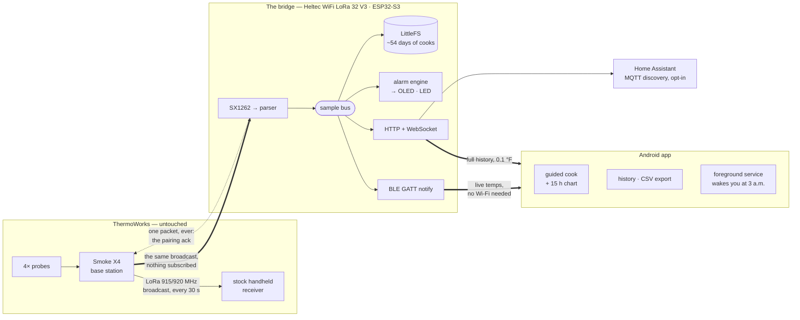

<div align="center">

# Smoke X4 Smart Bridge

**Give your ThermoWorks Smoke X2/X4 a memory, a graph, and a phone.**

A small ESP32 board quietly listens to your Smoke X base station, records every cook to flash for
~54 days, and serves it to an Android app over Bluetooth or Wi-Fi.
Your stock receiver keeps working — the bridge never transmits.

[](LICENSE)


</div>

---

## How it works



The base station already shouts your probe temperatures over LoRa every 30 seconds so its
handheld can display them. The bridge is simply **another set of ears**: it decodes the same
broadcast, writes it down permanently, and puts it on your phone. It transmits exactly **one**
packet in its entire life — the pairing acknowledgement — and that invariant is enforced in code
and by unit test ([02 §2.5](docs/design/02-smoke-x-protocol.md)).

---

## Deploy

Two commands. With a release `.bin` and `.apk` in hand you need only `esptool` and `adb` — no
ESP-IDF, no Flutter, no compiler.

```bash
./scripts/deploy.sh doctor     # what's installed, what's missing, what each thing is for
```

### 1 · Flash the bridge

Plug the Heltec board into USB. **Fit the LoRa antenna first** — powering an SX1262 with an open
antenna port can destroy it.

```bash
pip install esptool                       # the only dependency
./scripts/deploy.sh bridge --image smoke-bridge-heltec-v3-1.0.0.bin
```

Take that `.bin` from a [release](../../releases), or build one yourself with `--build`. The
script auto-detects the serial port, refuses to write to the wrong chip, and prints exactly what
it is about to do before it does it.

<details>
<summary><b>No terminal? Flash it from Chrome instead.</b></summary>

<br>

Releases publish a browser installer built on
[esp-web-tools](https://esphome.github.io/esp-web-tools/). Open the release page in Chrome or
Edge, click **Connect**, pick the serial port. No Python, no esptool, no toolchain — the merged
image is written straight from the page.

</details>

<details>
<summary><b>Options</b></summary>

<br>

```
--image FILE   merged image to write (default: newest in dist/)
--build        build it from source first (needs ESP-IDF)
--port PORT    serial port (default: auto-detect)
--erase        wipe the flash first — DELETES STORED COOKS
--monitor      open a serial monitor afterwards
```

</details>

### 2 · Install the app

Connect an Android phone (7.0+) with USB debugging enabled.

```bash
./scripts/deploy.sh app                                  # builds a release APK and installs it
./scripts/deploy.sh app --apk smoke-bridge-1.0.0.apk     # or install a released one
```

Open **Smoke Bridge**. It finds the board over Bluetooth and walks you through a three-hop
setup — pair, name it, optionally add Wi-Fi. You can skip Wi-Fi entirely; Bluetooth alone gives
you live temperatures at the smoker.

Last step, on the base station: hold **SYNC** until the bridge's OLED confirms the pairing.

---

## What you get

|                          |                                                                                                                                        |
| ------------------------ | -------------------------------------------------------------------------------------------------------------------------------------- |
| **Guided cooks**         | Pick a cut and get target and pull-early temps, a doneness gauge, and an ETA. Survives the app being killed at hour nine of a brisket. |
| **A real graph**         | Every probe, 15 hours on one screen, 0.1 °F, pan and zoom — not a rolling window that forgets.                                         |
| **~54 days of history**  | Append-only binary log on flash. A power blip costs you nothing; the upstream project's RAM array lost the entire cook.                |
| **Alarms that wake you** | An on-device engine fires with no phone present; the app's foreground service pushes notifications while you sleep.                    |
| **Bluetooth-first**      | Wi-Fi is an upgrade, not a prerequisite. The app drops to BLE and climbs back on its own.                                              |
| **Home Assistant**       | Opt-in MQTT with discovery. Your pit temperature becomes a sensor.                                                                     |
| **Coexistence**          | Your stock receiver — and every other paired receiver — keeps working exactly as before.                                               |
| **OTA updates**          | Push new firmware from the app, behind a rollback gate.                                                                                |

---

## Build from source

```bash
make test-host    # C unit tests — gcc + cmake, no ESP-IDF, no hardware
make sim          # fake bridge serving a synthetic 18-hour brisket on :8080
cd app && flutter test && flutter run     # the app, against the simulator

make build            # firmware (needs ESP-IDF)
make flash-monitor    # build, flash, and watch the serial log
```

`make sim` is the point: **the app is developed without the hardware.** The simulator serves the
full device API — HTTP, WebSocket, and the error paths — from a generated cook.

<details>
<summary><b>Repo map</b></summary>

<br>

```
firmware/   ESP-IDF project (ESP32-S3) + host-testable components + test/ (plain CMake)
app/        Flutter app (Android first), package smoke_bridge
protocol/   * the contract: records.yaml, openapi.yaml, ble-gatt.md, fixtures/, gen/
tools/      protogen (codegen) · cookgen · sim · lora · flash (release packaging) · soak
scripts/    deploy.sh — the turnkey flash + install path
docs/       design docs, task backlog, read-only reference snapshot
```

`protocol/` is the single source of truth. Byte layouts are generated from
[`records.yaml`](protocol/records.yaml) into **both C and Dart**, and CI fails if the committed
outputs drift — so a C struct and a Dart model cannot quietly disagree.

</details>

---

## Three things to know before you build one

- **The bridge is a listener, never a transmitter.** One LoRa packet in its lifetime: the pairing
  ack. Pairing the bridge unpairs nothing.
- **Smoke X LoRa traffic is unencrypted and unauthenticated.** Anyone within roughly a mile with
  an SX1262 can read your probe temperatures, and could in principle forge packets. That is a
  property of the product, not of this bridge — but you deserve to know it. The bridge never
  forwards raw LoRa frames anywhere.
- **Long cooks want USB power.** A Wi-Fi AP cannot sleep; on the 3000 mAh pack, hosted-AP mode
  lasts roughly 18 hours, which is less than a brisket. Run it from a wall adapter or a power bank
  with the battery as a UPS ([01 §1.6](docs/design/01-hardware.md)).

## Hardware

| Part                                            | Notes                                                                          |
| ----------------------------------------------- | ------------------------------------------------------------------------------ |
| Heltec WiFi LoRa 32 **V3**                      | ESP32-S3 + SX1262 + 128×64 OLED. V2 is a different radio and is not supported. |
| 915 MHz antenna                                 | **Fit it before first power-up.**                                              |
| ThermoWorks Smoke X2 or X4                      | X4 is the target; X2 falls out of the same parser.                             |
| USB-C cable · 3000 mAh SH1.25-2 pack (optional) | The pack is a UPS, not a power plan.                                           |

## Docs

Start at [`docs/design/README.md`](docs/design/README.md) — hardware, protocol, firmware
architecture, storage, connectivity, the device API, the app, alarms, and the roadmap. Bench
results are in [`docs/hardware-verified.md`](docs/hardware-verified.md), the execution plan in
[`docs/tasks/`](docs/tasks/README.md), and contributor setup in
[`CONTRIBUTING.md`](CONTRIBUTING.md).

The rebuilt app (the `newui/` design language) is at [`app/`](app/): see
[`docs/new-app.md`](docs/new-app.md) for the entry point and
[`docs/RELEASE.md`](docs/RELEASE.md) for the release checklist. The legacy app is archived
(git-ignored) at `app.old/`.

## Provenance and attribution

Protocol decoding, the SX1262 driver integration, and the pairing handshake derive from
[`G-Two/smoke-x-receiver`](https://github.com/G-Two/smoke-x-receiver) (MIT © 2022 G-Two),
vendored read-only at [`docs/reference/smoke-x-receiver`](docs/reference/PROVENANCE.md). Files
carried over retain the upstream notice. `docs/reference/` is never edited.

**This project is not affiliated with or endorsed by ThermoWorks.** Smoke X is a trademark of its
owner; it is used here only to describe compatibility.

## License

MIT — see [LICENSE](LICENSE).
